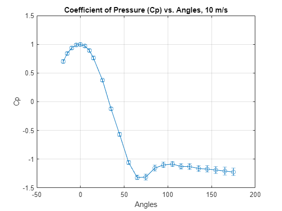
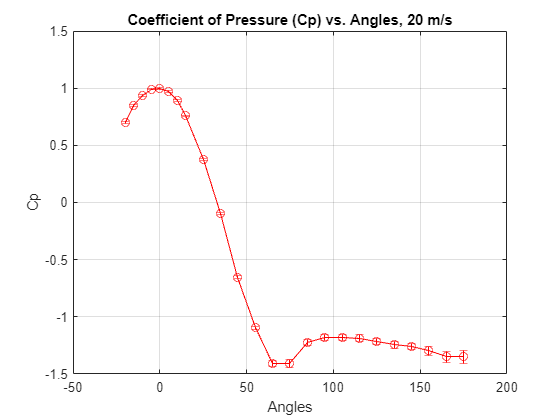
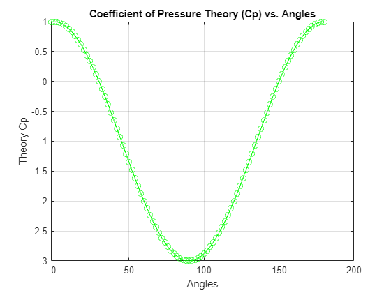
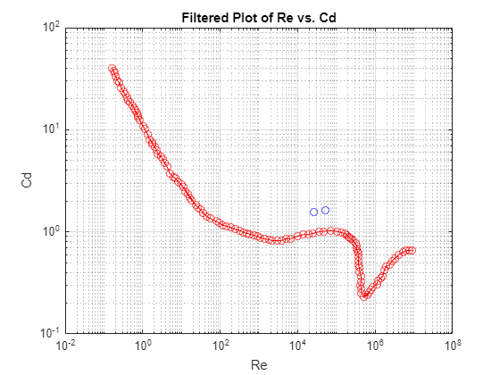
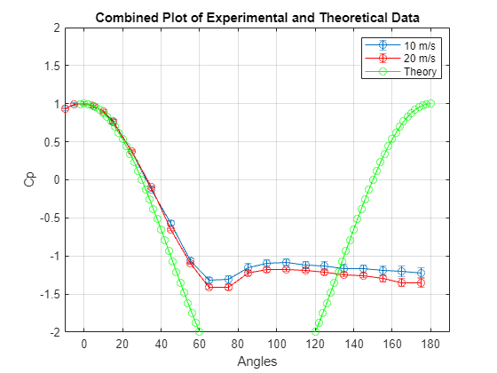
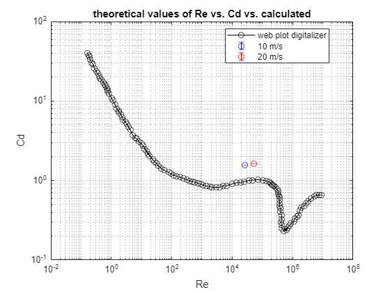

```matlab:Code
clc; clear;

% Parameters
R = 287; % J/kgK
P_infinity = 101.659 * 10^3; % Pa (originally 30.02 in Hg)
T = 295.37; % Kelvin
N = 15000;
d = 4 / 100; % Tube diameter in meters

% Conversion Variables
Inch_water_col_to_pascal_conversion = 248.84;

% Basic Equations
air_density = P_infinity / (R * T); % kg/m^3 from ideal gas law

% Experimental Data - 10 m/s
velocity1 = 10; 
Calculated_pressure_v10 = 239.8; % 0.964 in H2O
angle_data_10mps = zeros(1, 24);
diff_pressure_10mps = zeros(1, 24);
std_diff_pressure_10mps = zeros(1, 24);

% Load and process data for 10 m/s
dir_address = 'C:\Users\kaleb\OneDrive\Documents\MATLAB\AE lab 2';
ifname = 'lab2_10mps_';
for i = 1:24
    data = load(fullfile(dir_address, [ifname num2str(i) '.mat']));
    data.dp = data.dp * Inch_water_col_to_pascal_conversion;
    diff_pressure_10mps(i) = mean(data.dp);   
    std_diff_pressure_10mps(i) = std(data.dp); 
    angle_data_10mps(i) = data.currAngle;
end

% Find max pressure and adjust freestream velocity
Max_diff_pressure_10 = max(diff_pressure_10mps);
velocity_from_max_10 = sqrt(2 * Max_diff_pressure_10 / air_density);

% Calculate Cp for 10 m/s
Cp_10mps = diff_pressure_10mps / Max_diff_pressure_10;
angle_adjustment_10mps = find(Cp_10mps == max(Cp_10mps));
angle_10mps = angle_data_10mps - angle_data_10mps(angle_adjustment_10mps);

% Convert std from dynamic pressure to Cp
error_bounds_10mps = std_diff_pressure_10mps / Max_diff_pressure_10;

% Plot Cp vs. angle for 10 m/s
figure;
errorbar(angle_10mps, Cp_10mps, error_bounds_10mps, '-o');
xlabel('Angles');
ylabel('Cp');
grid on;
title('Coefficient of Pressure (Cp) vs. Angles, 10 m/s');
```





```matlab:Code

% Calculate Reynolds number for 10 m/s
reynolds_number_max_10 = d * velocity_from_max_10 * air_density / 1.8240e-5;
fprintf('the Reynolds number at 10 m/s is %.3g',reynolds_number_max_10)
```


```text:Output
the Reynolds number at 10 m/s is 2.67e+04
```


```matlab:Code

% Integrate to get Cd for 10 m/s
angle_r_10mps = angle_data_10mps .* pi / 180;
Cd_index_10mps = Cp_10mps .* cos(angle_r_10mps);
integrated_value_10mps = trapz(angle_r_10mps(2:23), Cd_index_10mps(2:23));

% Experimental Data - 20 m/s
velocity2 = 20;
Calculated_pressure_v20 = 59; % 0.241 in H2O
angle_data_20mps = zeros(1, 24);
diff_pressure_20mps = zeros(1, 24);
std_diff_pressure_20mps = zeros(1, 24);

% Load and process data for 20 m/s
ifname = 'lab2_20mps_';
for i = 1:24
    data20 = load(fullfile(dir_address, [ifname num2str(i) '.mat']));
    data20.dp = data20.dp * Inch_water_col_to_pascal_conversion;
    diff_pressure_20mps(i) = mean(data20.dp);   
    std_diff_pressure_20mps(i) = std(data20.dp); 
    angle_data_20mps(i) = data20.currAngle;
end

% Find max pressure and adjust freestream velocity for 20 m/s
Max_diff_pressure_20 = max(diff_pressure_20mps);
velocity_from_max_20 = sqrt(2 * Max_diff_pressure_20 / air_density);

% Calculate Cp for 20 m/s
Cp_20mps = diff_pressure_20mps / Max_diff_pressure_20;
angle_adjustment_20mps = find(Cp_20mps == max(Cp_20mps));
angle_20mps = angle_data_20mps - angle_data_20mps(angle_adjustment_20mps);

% Convert std from dynamic pressure to Cp for 20 m/s
error_bounds_20mps = std_diff_pressure_20mps / Max_diff_pressure_20;

% Plot Cp vs. angle for 20 m/s
figure;
errorbar(angle_20mps, Cp_20mps, error_bounds_20mps, '-o', 'Color', 'r');
xlabel('Angles');
ylabel('Cp');
grid on;
title('Coefficient of Pressure (Cp) vs. Angles, 20 m/s');
```





```matlab:Code

% Calculate Reynolds number for 20 m/s
reynolds_number_max_20 = d * velocity_from_max_20 * air_density / 1.8240e-5;
fprintf('the Reynolds number at 20 m/s is %.3g',reynolds_number_max_10)
```


```text:Output
the Reynolds number at 20 m/s is 2.67e+04
```


```matlab:Code

% Integrate to get Cd for 20 m/s
angle_r_20mps = angle_data_20mps .* pi / 180;
Cd_index_20mps = Cp_20mps .* cos(angle_r_20mps);
integrated_value_20mps = trapz(angle_r_20mps(2:23), Cd_index_20mps(2:23));

% Plotting theoretical data
theta_theory = -2:2:180;
cp_theory = 1 - 4 * sind(theta_theory).^2;
figure;
plot(theta_theory, cp_theory, '-o', 'Color', 'g');
xlabel('Angles');
ylabel('Theory Cp');
grid on;
title('Coefficient of Pressure Theory (Cp) vs. Angles');
```





```matlab:Code

% Read the CSV file
data_webplot = readmatrix('DefaultDataset.csv');
reynolds_webplot = data_webplot(:, 1);
Cd_webplot = data_webplot(:, 2);

% Plot filtered data
figure;
loglog(reynolds_webplot, Cd_webplot, '-o', 'Color', 'r');
xlabel('Re');
ylabel('Cd');
title('Filtered Plot of Re vs. Cd');

grid on;

hold on;
loglog(reynolds_number_max_10, integrated_value_10mps, '-o', 'Color', 'b');
loglog(reynolds_number_max_20, integrated_value_20mps, '-o', 'Color', 'b');
```





```matlab:Code

% Plotting all the data together
figure;
errorbar(angle_10mps, Cp_10mps, error_bounds_10mps, '-o', 'DisplayName', '10 m/s');
hold on;
errorbar(angle_20mps, Cp_20mps, error_bounds_20mps, '-o', 'Color', 'r', 'DisplayName', '20 m/s');
plot(theta_theory, cp_theory, '-o', 'Color', 'g', 'DisplayName', 'Theory');
xlabel('Angles');
ylabel('Cp');
grid on;
title('Combined Plot of Experimental and Theoretical Data');
legend('Location', 'best');
xlim([-10, 190]);
ylim([-2, 2]);

%Now caluclate the error of Cd using leibniz integral rule, check this is
%the proper way to do it
Cd_error_index_10mps = cos(angle_r_10mps)./Max_diff_pressure_10;
Cd_error_value_10mps = trapz(angle_r_10mps(2:23), Cd_error_index_10mps(2:23));

Cd_error_index_20mps = cos(angle_r_20mps)./Max_diff_pressure_20;
Cd_error_value_20mps = trapz(angle_r_20mps(2:23), Cd_error_index_20mps(2:23));

fprintf('the Cd number at 10 m/s is %.3g ± %.3g', integrated_value_10mps, Cd_error_value_10mps);
```


```text:Output
the Cd number at 10 m/s is 1.56 ± 1.54e-05
```


```matlab:Code
fprintf('the Cd number at 20 m/s is %.3g ± %.3g', integrated_value_20mps, Cd_error_value_20mps);
```


```text:Output
the Cd number at 20 m/s is 1.64 ± 3.92e-06
```


```matlab:Code

% Calculate Drag
Drag10 = integrated_value_10mps * Max_diff_pressure_10 * d;
Drag20 = integrated_value_20mps * Max_diff_pressure_20 * d;

% Uncertainty in Drag
Drag_error_10 = Drag10 * (Cd_error_value_10mps / integrated_value_10mps);
Drag_error_20 = Drag20 * (Cd_error_value_20mps / integrated_value_20mps);

fprintf('the 2D Drag number at 10 m/s is %.3g ± %.3g newtons\n', Drag10, Drag_error_10);
```


```text:Output
the 2D Drag number at 10 m/s is 3.85 ± 3.81e-05 newtons
```


```matlab:Code
fprintf('the 2D Drag number at 20 m/s is %.3g ± %.3g newtons\n', Drag20, Drag_error_20);
```


```text:Output
the 2D Drag number at 20 m/s is 16 ± 3.81e-05 newtons
```


```matlab:Code

hold off
```





```matlab:Code
% Plot filtered data
figure;
loglog(reynolds_webplot, Cd_webplot, '-o', 'Color', 'k');
xlabel('Re');
ylabel('Cd');
title('theoretical values of Re vs. Cd vs. calculated');

grid on;

hold on;
errorbar(reynolds_number_max_10, integrated_value_10mps, Cd_error_value_10mps, '-o','vertical', 'Color', 'b', 'LineStyle', 'none');
errorbar(reynolds_number_max_20, integrated_value_20mps, Cd_error_value_20mps, '-o','vertical', 'Color', 'r', 'LineStyle', 'none');

%loglog(reynolds_number_max_10, integrated_value_10mps, '-o', 'Color', 'b');
%loglog(reynolds_number_max_20, integrated_value_20mps, '-o', 'Color', 'b');
legend('web plot digitalizer', '10 m/s', '20 m/s', 'Location', 'best');
```





```matlab:Code

```

