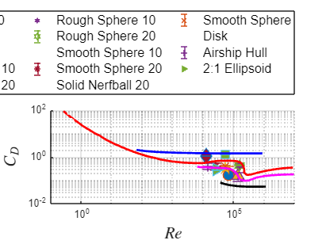

```matlab:Code
 clc; clear;
%tube diameter 4cm
%use frequencies are [6,12,18,24], data_1 is with the fan off
R = 287; % J/kgK
P_infinity = 101.659*10^3; %(Pa) originally 30.02 in Hg
T = 295.92; % (Kelvin)
N = 15000;
d= 4/100;

% Converstion Variables:
%_____________________________________________________
Inch_water_col_to_pascal_conversion = 248.84;
kd = -27.4588 %need to do 27*Dmodel-dsting);
```


```text:Output
kd = -27.4588
```


```matlab:Code
%dp dynamic pressure from previous labs
dp10 = 60.127 %pascal
```


```text:Output
dp10 = 60.1270
```


```matlab:Code
dp20 = 240.5 %pascal
```


```text:Output
dp20 = 240.5000
```


```matlab:Code

dp10_error = 1.9145; %This is from the std from lab 2 
dp20_error = 1.9922;

% Basic Equations:
%_____________________________________________________
air_density = P_infinity/(R*T) % kg/m^3 from ideal gas law
```


```text:Output
air_density = 1.1970
```


```matlab:Code
velocity1 = 10; velocity2 = 20;
dynamic_viscosity = 1.8e-5;

%-----------------------
%Record with the fan off to get a base line for 0

dir_address='C:\Users\nailsk\Downloads\AE lab 3'; % paste the address of the folder your Cd data is saved within the ('')inverted commas

read_mat_files(dir_address)
% Load the data from the file
%{
file_path = 'C:\Users\nailsk\Downloads\AE lab 3\DragCalibCoeff.mat';
calibdata = load(file_path);

% Access the variables in the loaded data
kd = calibdata.pDrag(1) 
kd_error = 0
%}

% Calculate the drag for each object
Drag_Chicken_Wing_10 = kd * (Sec2_drag_Chicken_Wing_10 - Sec2_drag_Chicken_Wing_10_tare - (Sec2_drag_Sting_10 - Sec2_drag_Sting_10_tare));
Drag_Chicken_Wing_20 = kd * (Sec2_drag_Chicken_Wing_20 - Sec2_drag_Chicken_Wing_20_tare - (Sec2_drag_Sting_20 - Sec2_drag_Sting_20_tare));
Drag_Cup_20 = kd * (Sec2_drag_Cup_20 - Sec2_drag_Cup_20_tare - (Sec2_drag_Sting_20 - Sec2_drag_Sting_20_tare));
Drag_Disk_20 = kd * (Sec2_drag_Disk_20 - Sec2_drag_Disk_20_tare - (Sec2_drag_Sting_20 - Sec2_drag_Sting_20_tare));
Drag_Hemisphere_20 = kd * (Sec2_drag_Hemisphere_20 - Sec2_drag_Hemisphere_20_tare - (Sec2_drag_Sting_20 - Sec2_drag_Sting_20_tare));
Drag_Hollow_Nerfball_20 = kd * (Sec2_drag_Hollow_Nerfball_20 - Sec2_drag_Hollow_Nerfball_20_tare - (Sec2_drag_Sting_20 - Sec2_drag_Sting_20_tare));
Drag_Ping_Pong_10 = kd * (Sec2_drag_Ping_Pong_10 - Sec2_drag_Ping_Pong_10_tare - (Sec2_drag_Sting_10 - Sec2_drag_Sting_10_tare));
Drag_Ping_Pong_20 = kd * (Sec2_drag_Ping_Pong_20 - Sec2_drag_Ping_Pong_20_tare - (Sec2_drag_Sting_20 - Sec2_drag_Sting_20_tare));
Drag_Rainbow_Golfball_10 = kd * (Sec2_drag_Rainbow_Golfball_10 - Sec2_drag_Rainbow_Golfball_10_tare - (Sec2_drag_Sting_10 - Sec2_drag_Sting_10_tare));
Drag_Rainbow_Golfball_20 = kd * (Sec2_drag_Rainbow_Golfball_20 - Sec2_drag_Rainbow_Golfball_20_tare - (Sec2_drag_Sting_20 - Sec2_drag_Sting_20_tare));
Drag_Rough_Sphere_10 = kd * (Sec2_drag_Rough_Sphere_10 - Sec2_drag_Rough_Sphere_10_tare - (Sec2_drag_Sting_10 - Sec2_drag_Sting_10_tare));
Drag_Rough_Sphere_20 = kd * (Sec2_drag_Rough_Sphere_20 - Sec2_drag_Rough_Sphere_20_tare - (Sec2_drag_Sting_20 - Sec2_drag_Sting_20_tare));
Drag_Smooth_Sphere_10 = kd * (Sec2_drag_Smooth_Sphere_10 - Sec2_drag_Smooth_Sphere_10_tare - (Sec2_drag_Sting_10 - Sec2_drag_Sting_10_tare));
Drag_Smooth_Sphere_20 = kd * (Sec2_drag_Smooth_Sphere_20 - Sec2_drag_Smooth_Sphere_20_tare - (Sec2_drag_Sting_20 - Sec2_drag_Sting_20_tare));
Drag_Solid_Nerfball_20 = kd * (Sec2_drag_Solid_Nerfball_20 - Sec2_drag_Solid_Nerfball_20_tare - (Sec2_drag_Sting_20 - Sec2_drag_Sting_20_tare));
%Drag_Sting_10 = kd * (Sec2_drag_Sting_10 - Sec2_drag_Sting_10_tare);
%Drag_Sting_20 = kd * (Sec2_drag_Sting_20 - Sec2_drag_Sting_20_tare);

std_Drag_Chicken_Wing_10 = std(Drag_Chicken_Wing_10)/sqrt(3000);
std_Drag_Chicken_Wing_20 = std(Drag_Chicken_Wing_20)/sqrt(3000);
std_Drag_Cup_20 = std(Drag_Cup_20)/sqrt(3000);
std_Drag_Disk_20 = std(Drag_Disk_20)/sqrt(3000);
std_Drag_Hemisphere_20 = std(Drag_Hemisphere_20)/sqrt(3000);
std_Drag_Hollow_Nerfball_20 = std(Drag_Hollow_Nerfball_20)/sqrt(3000);
std_Drag_Ping_Pong_10 = std(Drag_Ping_Pong_10)/sqrt(3000);
std_Drag_Ping_Pong_20 = std(Drag_Ping_Pong_20)/sqrt(3000);
std_Drag_Rainbow_Golfball_10 = std(Drag_Rainbow_Golfball_10)/sqrt(3000);
std_Drag_Rainbow_Golfball_20 = std(Drag_Rainbow_Golfball_20)/sqrt(3000);
std_Drag_Rough_Sphere_10 = std(Drag_Rough_Sphere_10)/sqrt(3000);
std_Drag_Rough_Sphere_20 = std(Drag_Rough_Sphere_20)/sqrt(3000);
std_Drag_Smooth_Sphere_10 = std(Drag_Smooth_Sphere_10)/sqrt(3000);
std_Drag_Smooth_Sphere_20 = std(Drag_Smooth_Sphere_20)/sqrt(3000);
std_Drag_Solid_Nerfball_20 = std(Drag_Solid_Nerfball_20)/sqrt(3000);
```


```matlab:Code

Drag_Chicken_Wing_10 = mean(Drag_Chicken_Wing_10)
Drag_Chicken_Wing_20 = mean(Drag_Chicken_Wing_20)
Drag_Cup_20 = mean(Drag_Cup_20)
Drag_Disk_20 = mean(Drag_Disk_20)
Drag_Hemisphere_20 = mean(Drag_Hemisphere_20)
Drag_Hollow_Nerfball_20 = mean(Drag_Hollow_Nerfball_20)
Drag_Ping_Pong_10 = mean(Drag_Ping_Pong_10)
Drag_Ping_Pong_20 = mean(Drag_Ping_Pong_20)
Drag_Rainbow_Golfball_10 = mean(Drag_Rainbow_Golfball_10)
Drag_Rainbow_Golfball_20 = mean(Drag_Rainbow_Golfball_20)
Drag_Rough_Sphere_10 = mean(Drag_Rough_Sphere_10)
Drag_Rough_Sphere_20 = mean(Drag_Rough_Sphere_20)
Drag_Smooth_Sphere_10 = mean(Drag_Smooth_Sphere_10)
Drag_Smooth_Sphere_20 = mean(Drag_Smooth_Sphere_20)
Drag_Solid_Nerfball_20 = mean(Drag_Solid_Nerfball_20)

%Here is the diameter
Disk_diameter = 76 * 10^-3
Cup_diameter = 78.3 * 10^-3
Hemisphere_diameter = 78.3 * 10^-3
Smooth_Sphere_diameter = 75.8 * 10^-3
Rough_Sphere_diameter = 77.2 * 10^-3
Ping_Pong_Ball_diameter = 40.2 * 10^-3
Golf_Ball_diameter = 42 * 10^-3
Solid_Nerf_Ball_diameter = 86.7 * 10^-3
Hollow_Nerf_Ball_diameter_outer = 88.1 * 10^-3
Hollow_Nerf_Ball_diameter_inner = 47.2 * 10^-3
Chicken_Wing_diameter = 30.7 * 10^-3

%record lengths for fun
solid_nerf_ball_length = 159.6*10^-3;
hollow_nerf_ball_length = 115.1 *10^-3;
chicken_wing_length = 102.5*10^-3;

error = 0.05*10^-3;

%calculate S
S_disk = pi*(Disk_diameter/2)^2;
S_cup = pi*(Cup_diameter/2)^2;
S_hemisphere = pi*(Hemisphere_diameter/2)^2;
S_smooth = pi*(Smooth_Sphere_diameter/2)^2
```


```text:Output
S_smooth = 0.0045
```


```matlab:Code
S_rough = pi*(Rough_Sphere_diameter/2)^2;
S_ping = pi*(Ping_Pong_Ball_diameter/2)^2;
S_golf= pi*(Golf_Ball_diameter/2)^2;
S_solid_nerf= pi*(Solid_Nerf_Ball_diameter/2)^2;
S_hollow_nerf= pi*((Hollow_Nerf_Ball_diameter_outer/2)^2-(Hollow_Nerf_Ball_diameter_inner/2)^2);
S_chicken= pi*(Chicken_Wing_diameter/2)^2;

S_error = .005; %error of the area

%calculate the Cds
Cd_chicken_10 = Drag_Chicken_Wing_10 / (dp10 * S_chicken)
Cd_chicken_20 = Drag_Chicken_Wing_20 / (dp20 * S_chicken)
Cd_cup_20 = Drag_Cup_20 / (dp20 * S_cup)
Cd_disk_20 = Drag_Disk_20 / (dp20 * S_disk)
Cd_hemisphere_20 = Drag_Hemisphere_20 / (dp20 * S_hemisphere)
Cd_hollow_nerfball_20 = Drag_Hollow_Nerfball_20 / (dp20 * S_hollow_nerf)
Cd_ping_pong_10 = Drag_Ping_Pong_10 / (dp10 * S_ping)
Cd_ping_pong_20 = Drag_Ping_Pong_20 / (dp20 * S_ping);
Cd_rainbow_golfball_10 = Drag_Rainbow_Golfball_10 / (dp10 * S_golf)
Cd_rainbow_golfball_20 = Drag_Rainbow_Golfball_20 / (dp20 * S_golf)
Cd_rough_sphere_10 = Drag_Rough_Sphere_10 / (dp10 * S_rough)
Cd_rough_sphere_20 = Drag_Rough_Sphere_20 / (dp20 * S_rough)
Cd_smooth_sphere_10 = Drag_Smooth_Sphere_10 / (dp10 * S_smooth)
Cd_smooth_sphere_20 = Drag_Smooth_Sphere_20 / (dp20 * S_smooth)
Cd_solid_nerfball_20 = Drag_Solid_Nerfball_20 / (dp20 * S_solid_nerf)

%now calculate uncertainity of Cd:
Cd_chicken_10_error = sqrt((std_Drag_Chicken_Wing_10/(dp10*S_chicken))^2 + (.0005*Drag_Chicken_Wing_10/(-dp10^2*S_chicken))^2)
Cd_chicken_20_error = sqrt((std_Drag_Chicken_Wing_20/(dp20*S_chicken))^2 + (.0005*Drag_Chicken_Wing_20/(-dp20^2*S_chicken))^2)
Cd_cup_20_error = sqrt((std_Drag_Cup_20/(dp20*S_cup))^2 + (.0005*Drag_Cup_20/(-dp20^2*S_cup))^2)
Cd_disk_20_error = sqrt((std_Drag_Disk_20/(dp20*S_disk))^2 + (.0005*Drag_Disk_20/(-dp20^2*S_disk))^2)
Cd_hemisphere_20_error = sqrt((std_Drag_Hemisphere_20/(dp20*S_hemisphere))^2 + (.0005*Drag_Hemisphere_20/(-dp20^2*S_hemisphere))^2)
Cd_hollow_nerfball_20_error = sqrt((std_Drag_Hollow_Nerfball_20/(dp20*S_hollow_nerf))^2 + (.0005*Drag_Hollow_Nerfball_20/(-dp20^2*S_hollow_nerf))^2)
Cd_ping_pong_10_error = sqrt((std_Drag_Ping_Pong_10/(dp10*S_ping))^2 + (.0005*Drag_Ping_Pong_10/(-dp10^2*S_ping))^2)
Cd_ping_pong_20_error = sqrt((std_Drag_Ping_Pong_20/(dp20*S_ping))^2 + (.0005*Drag_Ping_Pong_20/(-dp20^2*S_ping))^2)
Cd_rainbow_golfball_10_error = sqrt((std_Drag_Rainbow_Golfball_10/(dp10*S_golf))^2 + (.0005*Drag_Rainbow_Golfball_10/(-dp10^2*S_golf))^2)
Cd_rainbow_golfball_20_error = sqrt((std_Drag_Rainbow_Golfball_20/(dp20*S_golf))^2 + (.0005*Drag_Rainbow_Golfball_20/(-dp20^2*S_golf))^2)
Cd_rough_sphere_10_error = sqrt((std_Drag_Rough_Sphere_10/(dp10*S_rough))^2 + (.0005*Drag_Rough_Sphere_10/(-dp10^2*S_rough))^2)
Cd_rough_sphere_20_error = sqrt((std_Drag_Rough_Sphere_20/(dp20*S_rough))^2 + (.0005*Drag_Rough_Sphere_20/(-dp20^2*S_rough))^2)
Cd_smooth_sphere_10_error = sqrt((std_Drag_Smooth_Sphere_10/(dp10*S_smooth))^2 + (.0005*Drag_Smooth_Sphere_10/(-dp10^2*S_smooth))^2)
Cd_smooth_sphere_20_error = sqrt((std_Drag_Smooth_Sphere_20/(dp20*S_smooth))^2 + (.0005*Drag_Smooth_Sphere_20/(-dp20^2*S_smooth))^2)
Cd_solid_nerfball_20_error = sqrt((std_Drag_Solid_Nerfball_20/(dp20*S_solid_nerf))^2 + (.0005*Drag_Solid_Nerfball_20/(-dp20^2*S_solid_nerf))^2)

%calculate charecteristic length
Cl_disk = 9.6*10^-3
Cl_cup = (Cup_diameter/2)
Cl_hemisphere = (Hemisphere_diameter/2)
Cl_smooth = (Smooth_Sphere_diameter)
Cl_rough = Rough_Sphere_diameter
Cl_ping = Ping_Pong_Ball_diameter
Cl_golf= Golf_Ball_diameter/2
Cl_solid_nerf= 159.6*10^-3
Cl_hollow_nerf= 115.1*10^-3
Cl_chicken= 102.5*10^-3

chicken_10_reynolds = (Cl_chicken*10*air_density)/dynamic_viscosity;
chicken_20_reynolds = (Cl_chicken*20*air_density)/dynamic_viscosity;
cup_20_reynolds = (Cl_cup*20*air_density)/dynamic_viscosity;
disk_20_reynolds = (Cl_disk*20*air_density)/dynamic_viscosity;
hemisphere_20_reynolds = (Cl_hemisphere*20*air_density)/dynamic_viscosity;
hollow_nerfball_20_reynolds = (Cl_hollow_nerf*20*air_density)/dynamic_viscosity;
ping_pong_10_reynolds = (Cl_ping*10*air_density)/dynamic_viscosity;
ping_pong_20_reynolds = (Cl_ping*20*air_density)/dynamic_viscosity;
rainbow_golfball_10_reynolds = (Cl_golf*10*air_density)/dynamic_viscosity;
rainbow_golfball_20_reynolds = (Cl_golf*20*air_density)/dynamic_viscosity;
rough_sphere_10_reynolds = (Cl_rough*10*air_density)/dynamic_viscosity;
rough_sphere_20_reynolds = (Cl_rough*20*air_density)/dynamic_viscosity;
smooth_sphere_10_reynolds = (Cl_smooth*10*air_density)/dynamic_viscosity;
smooth_sphere_20_reynolds = (Cl_smooth*20*air_density)/dynamic_viscosity;
solid_nerfball_20_reynolds = (Cl_solid_nerf*20*air_density)/dynamic_viscosity;

%calculate aspect ration:
% Calculate aspect ratios
AR_Disk = (Cl_disk^2) / S_disk
```


```text:Output
AR_Disk = 0.0203
```


```matlab:Code
AR_Cup = (Cl_cup^2) / S_cup
```


```text:Output
AR_Cup = 0.3183
```


```matlab:Code
AR_Hemisphere = (Cl_hemisphere^2) / S_hemisphere
```


```text:Output
AR_Hemisphere = 0.3183
```


```matlab:Code
AR_Hollow_Nerfball = (Cl_hollow_nerf^2) / S_hollow_nerf
```


```text:Output
AR_Hollow_Nerfball = 3.0482
```


```matlab:Code
AR_Solid_Nefrball = (Cl_solid_nerf^2) / S_solid_nerf
```


```text:Output
AR_Solid_Nefrball = 4.3146
```


```matlab:Code
AR_Ping_Pong = (Cl_ping^2) / S_ping
```


```text:Output
AR_Ping_Pong = 1.2732
```


```matlab:Code
AR_Rainbow_Goldfball = (Cl_golf^2) / S_golf
```


```text:Output
AR_Rainbow_Goldfball = 0.3183
```


```matlab:Code
AR_Rough_Sphere = (Cl_rough^2) / S_rough
```


```text:Output
AR_Rough_Sphere = 1.2732
```


```matlab:Code
AR_Smooth_Sphere = (Cl_smooth^2) / S_smooth
```


```text:Output
AR_Smooth_Sphere = 1.2732
```


```matlab:Code
AR_Chicken_Wing = (Cl_chicken^2) / S_chicken
```


```text:Output
AR_Chicken_Wing = 14.1932
```


```matlab:Code

```


```matlab:Code

% Define variables (assuming these are your calculated values)
Cd_values = [Cd_chicken_10, Cd_chicken_20, Cd_cup_20, Cd_disk_20, Cd_hemisphere_20, ...
             Cd_hollow_nerfball_20, Cd_ping_pong_10, Cd_ping_pong_20, ...
             Cd_rainbow_golfball_10, Cd_rainbow_golfball_20, Cd_rough_sphere_10, ...
             Cd_rough_sphere_20, Cd_smooth_sphere_10, Cd_smooth_sphere_20, ...
             Cd_solid_nerfball_20];

Reynolds_values = [chicken_10_reynolds, chicken_20_reynolds, cup_20_reynolds, ...
                   disk_20_reynolds, hemisphere_20_reynolds, hollow_nerfball_20_reynolds, ...
                   ping_pong_10_reynolds, ping_pong_20_reynolds, ...
                   rainbow_golfball_10_reynolds, rainbow_golfball_20_reynolds, ...
                   rough_sphere_10_reynolds, rough_sphere_20_reynolds, ...
                   smooth_sphere_10_reynolds, smooth_sphere_20_reynolds, ...
                   solid_nerfball_20_reynolds];

% Load additional data
load CdvsReData

figure;
scatter(chicken_10_reynolds, Cd_chicken_10, 100, 'o', 'filled', 'DisplayName', 'Chicken 10')
hold on;
errorbar(chicken_10_reynolds, Cd_chicken_10, Cd_chicken_10_error, 'o', 'MarkerSize', 10, 'LineWidth', 1, 'CapSize', 10, 'DisplayName', 'Error')
scatter(chicken_20_reynolds, Cd_chicken_20, 100, '^', 'filled', 'DisplayName', 'Chicken 20')
errorbar(chicken_20_reynolds, Cd_chicken_20, Cd_chicken_20_error, '^', 'MarkerSize', 10, 'LineWidth', 1, 'CapSize', 10, 'DisplayName', 'Error')
scatter(cup_20_reynolds, Cd_cup_20, 100, 's', 'filled', 'DisplayName', 'Cup 20')
errorbar(cup_20_reynolds, Cd_cup_20, Cd_cup_20_error, 's', 'MarkerSize', 10, 'LineWidth', 1, 'CapSize', 10, 'DisplayName', 'Error')
scatter(disk_20_reynolds, Cd_disk_20, 100, 'd', 'filled', 'DisplayName', 'Disk 20')
errorbar(disk_20_reynolds, Cd_disk_20, Cd_disk_20_error, 'd', 'MarkerSize', 10, 'LineWidth', 1, 'CapSize', 10, 'DisplayName', 'Error')
scatter(hemisphere_20_reynolds, Cd_hemisphere_20, 100, 'p', 'filled', 'DisplayName', 'Hemisphere 20')
errorbar(hemisphere_20_reynolds, Cd_hemisphere_20, Cd_hemisphere_20_error, 'p', 'MarkerSize', 10, 'LineWidth', 1, 'CapSize', 10, 'DisplayName', 'Error')
scatter(hollow_nerfball_20_reynolds, Cd_hollow_nerfball_20, 100, 'h', 'filled', 'DisplayName', 'Hollow Nerfball 20')
errorbar(hollow_nerfball_20_reynolds, Cd_hollow_nerfball_20, Cd_hollow_nerfball_20_error, 'h', 'MarkerSize', 10, 'LineWidth', 1, 'CapSize', 10, 'DisplayName', 'Error')
scatter(ping_pong_10_reynolds, Cd_ping_pong_10, 100, '*', 'filled', 'DisplayName', 'Ping Pong 10')
errorbar(ping_pong_10_reynolds, Cd_ping_pong_10, Cd_ping_pong_10_error, '*', 'MarkerSize', 10, 'LineWidth', 1, 'CapSize', 10, 'DisplayName', 'Error')
scatter(ping_pong_20_reynolds, Cd_ping_pong_20, 100, 'x', 'filled', 'DisplayName', 'Ping Pong 20')
errorbar(ping_pong_20_reynolds, Cd_ping_pong_20, Cd_ping_pong_20_error, 'x', 'MarkerSize', 10, 'LineWidth', 1, 'CapSize', 10, 'DisplayName', 'Error')
scatter(rainbow_golfball_10_reynolds, Cd_rainbow_golfball_10, 100, '+', 'filled', 'DisplayName', 'Rainbow Golfball 10')
errorbar(rainbow_golfball_10_reynolds, Cd_rainbow_golfball_10, Cd_rainbow_golfball_10_error, '+', 'MarkerSize', 10, 'LineWidth', 1, 'CapSize', 10, 'DisplayName', 'Error')
scatter(rainbow_golfball_20_reynolds, Cd_rainbow_golfball_20, 100, '>', 'filled', 'DisplayName', 'Rainbow Golfball 20')
errorbar(rainbow_golfball_20_reynolds, Cd_rainbow_golfball_20, Cd_rainbow_golfball_20_error, '>', 'MarkerSize', 10, 'LineWidth', 1, 'CapSize', 10, 'DisplayName', 'Error')
hold off;
legend('show')

hold on;

plot(CdvsReSphere(:,1), CdvsReSphere(:,2), '-r', ...
    CdvsReDisk(:,1), CdvsReDisk(:,2), '-b', ...
    CdvsReHull(:,1), CdvsReHull(:,2), '-k', ...
    CdvsReEllipsoid(:,1), CdvsReEllipsoid(:,2), '-m', ...
    'LineWidth', 2);
hold off;

grid on;
xlim([0.1 1e7]);
ylim([0.01 100]);
set(gca, 'XScale', 'log', 'YScale', 'log');
xlabel('$Re$', 'Interpreter', 'latex', 'FontSize', 16);
ylabel('$C_D$', 'Interpreter', 'latex', 'FontSize', 16);

% Define legend entries for scatter plot
legend_entries_scatter = {'Chicken 10', 'Chicken 20', 'Cup 20', 'Disk 20', ...
                           'Hemisphere 20', 'Hollow Nerfball 20', 'Ping Pong 10', ...
                           'Ping Pong 20', 'Rainbow Golfball 10', 'Rainbow Golfball 20', ...
                           'Rough Sphere 10', 'Rough Sphere 20', 'Smooth Sphere 10', ...
                           'Smooth Sphere 20', 'Solid Nerfball 20'};

% Define legend entries for line plot
legend_entries_line = {'Smooth Sphere', 'Disk', 'Airship Hull', '2:1 Ellipsoid'};

legend([legend_entries_scatter, legend_entries_line], 'Location', 'NorthOutside', 'NumColumns', 4, 'FontSize', 12)
```





```matlab:Code

%{
legend('Cd_{chicken\_10} to Cd_{solid\_nerfball\_20}', ...
       'Smooth sphere', 'Disk', 'Airship hull', '2:1 Ellipsoid', ...
       'Location', 'NorthOutside', 'Numcolumns', 2, 'FontSize', 16, ...
       'Interpreter', 'latex'); 
%}

```


```matlab:Code
function read_mat_files(folder_path)
    % List all .mat files in the folder
    files = dir(fullfile(folder_path, '*.mat'));

    % Loop through each file
    for i = 1:numel(files)
        file_path = fullfile(folder_path, files(i).name);
        % Load the data from the file
        data = load(file_path);

        if isfield(data, 'volData')
            datastd=std(data.volData);

            data=(data.volData);
            
            % Get the variable name from the file name (remove .mat extension)
            [~, var_name, ~] = fileparts(files(i).name);
            datastring = append("std",var_name);
            % Assign the data to a variable with the file name
            assignin('caller', var_name, data);
            assignin('caller', datastring, datastd);
        end

        %disp(file_path)
        %disp(data)
        %data = mean(data.volData);

    end
end

```

