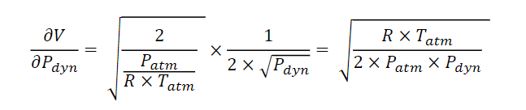
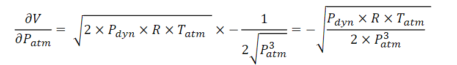
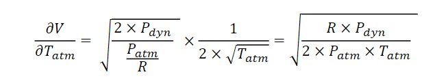
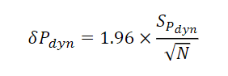
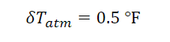
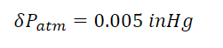
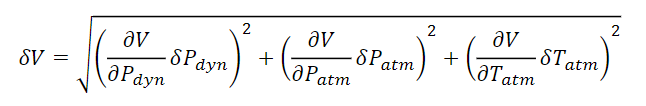
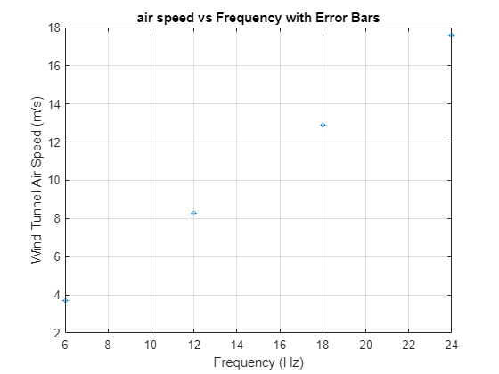
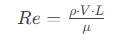

```matlab:Code
clc; clear

%use frequencies are [6,12,18,24], data_1 is with the fan off
R = 287; % J/kgK
P = 102472.12; %(Pa)
T = 294.82; % (Kelvin)
N = 15000;
frequency = [6,12,18,24]; % Hz

% Converstion Variables:
%_____________________________________________________
Inch_water_col_to_pascal_conversion = 248.84;

% Basic Equations:
%_____________________________________________________
air_density = P/(R*T) % kg/m^3 from ideal gas law
```


```text:Output
air_density = 1.2111
```


```matlab:Code

%-----------------------
%Record with the fan off to get a base line for 0
file_path = 'Dp_data_1.mat';
data = load(file_path);
Dynamic_Pressure1 = data.PdynRaw;
sensor_tearing_factor = mean(Dynamic_Pressure1);

%--------------------------------
%Load all the files and tear the data
file_path = 'Dp_data_2.mat';
data = load(file_path);
Dynamic_Pressure2 = data.PdynRaw;
DPPA2 = Inch_water_col_to_pascal_conversion.* (Dynamic_Pressure2-sensor_tearing_factor); %tearing the data set at zero speed
Pdyn = DPPA2(:)';

file_path = 'Dp_data_3.mat';
data = load(file_path);
Dynamic_Pressure2 = data.PdynRaw;
DPPA2 = 248.84.* (Dynamic_Pressure2-sensor_tearing_factor);
Pdyn2 = DPPA2(:)';

file_path = 'Dp_data_4.mat';
data = load(file_path);
Dynamic_Pressure3 = data.PdynRaw;
DPPA3 = Inch_water_col_to_pascal_conversion.* (Dynamic_Pressure3-sensor_tearing_factor);
Pdyn3 = DPPA3(:)';

file_path = 'Dp_data_5.mat';
data = load(file_path);
Dynamic_Pressure4 = data.PdynRaw;
DPPA4 = Inch_water_col_to_pascal_conversion.* (Dynamic_Pressure4-sensor_tearing_factor);
Pdyn4 = DPPA4(:)';

%---------------------------------
%Calculate the means and average velocities
Pdyn_mean1 = mean(Pdyn)
```


```text:Output
Pdyn_mean1 = 8.2861
```


```matlab:Code
Vavg1 = sqrt((2.*Pdyn_mean1)/air_density)
```


```text:Output
Vavg1 = 3.6992
```


```matlab:Code

Pdyn_mean2 = mean(Pdyn2);
Vavg2 = sqrt((2.*Pdyn_mean2)/air_density)
```


```text:Output
Vavg2 = 8.2674
```


```matlab:Code

Pdyn_mean3 = mean(Pdyn3);
Vavg3 = sqrt((2.*Pdyn_mean3)/air_density)
```


```text:Output
Vavg3 = 12.9035
```


```matlab:Code

Pdyn_mean4 = mean(Pdyn4);
Vavg4 = sqrt((2.*Pdyn_mean4)/air_density)
```


```text:Output
Vavg4 = 17.6142
```


```matlab:Code

%---------------------------------
%Calculate your uncertainties

```





```matlab:Code
dV_dPdyn = sqrt((R*T)/(2*P*Pdyn_mean1))
```


```text:Output
dV_dPdyn = 0.2232
```


```matlab:Code
dV_dPdyn2 = sqrt((R*T)/(2*P*Pdyn_mean2))
```


```text:Output
dV_dPdyn2 = 0.0999
```


```matlab:Code
dV_dPdyn3 = sqrt((R*T)/(2*P*Pdyn_mean3));
dV_dPdyn4 = sqrt((R*T)/(2*P*Pdyn_mean4));

```





```matlab:Code
dV_dP = -1.0.*sqrt((Pdyn_mean1*R*T)./(2.*(P^3)))
```


```text:Output
dV_dP = -1.8050e-05
```


```matlab:Code
dV_dP2 = -1.0.*sqrt((Pdyn_mean2*R*T)./(2.*(P^3)))
```


```text:Output
dV_dP2 = -4.0340e-05
```


```matlab:Code
dV_dP3 = -1.0.*sqrt((Pdyn_mean3*R*T)./(2.*(P^3)));
dV_dP4 = -1.0.*sqrt((Pdyn_mean4*R*T)./(2.*(P^3)));

```





```matlab:Code
dV_dT = sqrt((R*Pdyn_mean1)./(2.*P*T))
```


```text:Output
dV_dT = 0.0063
```


```matlab:Code
dV_dT2 = sqrt((R*Pdyn_mean2)./(2.*P*T))
```


```text:Output
dV_dT2 = 0.0140
```


```matlab:Code
dV_dT3 = sqrt((R*Pdyn_mean3)./(2.*P*T));
dV_dT4 = sqrt((R*Pdyn_mean4)./(2.*P*T));
```





```matlab:Code
%First get Spdyn or the standard deviation of each
S_Pdyn = std(Pdyn,1)
```


```text:Output
S_Pdyn = 1.5997
```


```matlab:Code
S_Pdyn2 = std(Pdyn2,1)
```


```text:Output
S_Pdyn2 = 1.2961
```


```matlab:Code
S_Pdyn3 = std(Pdyn3,1);
S_Pdyn4 = std(Pdyn4,1);

%Now find delta_Pdyn
delta_Pdyn = 1.96*(S_Pdyn/sqrt(N))
```


```text:Output
delta_Pdyn = 0.0256
```


```matlab:Code
delta_Pdyn2 = 1.96*(S_Pdyn2./sqrt(N))
```


```text:Output
delta_Pdyn2 = 0.0207
```


```matlab:Code
delta_Pdyn3 = 1.96*(S_Pdyn3./sqrt(N));
delta_Pdyn4 = 1.96*(S_Pdyn4./sqrt(N));

```





```matlab:Code
delta_T = 0.278; % Error in kelvin, already converted
```





```matlab:Code
delta_P = 16.9320; %Error in pa

%now calculate the final uncertainties
```





```matlab:Code
delta_V = sqrt(((dV_dPdyn.*delta_Pdyn).^2)+((dV_dP.*delta_P).^2)+((dV_dT.*delta_T).^2));
delta_V2 = sqrt(((dV_dPdyn2.*delta_Pdyn2).^2)+((dV_dP2.*delta_P).^2)+((dV_dT2.*delta_T).^2));
delta_V3 = sqrt(((dV_dPdyn3.*delta_Pdyn3).^2)+((dV_dP3.*delta_P).^2)+((dV_dT3.*delta_T).^2));
delta_V4 = sqrt(((dV_dPdyn4.*delta_Pdyn4).^2)+((dV_dP4.*delta_P).^2)+((dV_dT4.*delta_T).^2));

%-----------------------------------
%Now plot all of the data

VAVG = [Vavg1,Vavg2, Vavg3, Vavg4];
error_value = [delta_V, delta_V2, delta_V3, delta_V4];
  % Replace this with your actual error value

% Plotting
figure;
h = errorbar(frequency, VAVG, error_value, 'LineStyle', 'none');
set(h, 'Marker', 'o','MarkerSize', 3);  % Add markers for data points
xlabel('Frequency (Hz)');
ylabel('Wind Tunnel Air Speed (m/s)');
title('air speed vs Frequency with Error Bars');
grid on;
```





```matlab:Code

% ---------------------------------------------------
%CALCULATE Re for each number 
```





```matlab:Code
dynamic_viscosity = 1.8e-5;  % Pa·s

Re_L1 = Vavg1*air_density/(dynamic_viscosity);
Re_L2 = Vavg2*air_density/(dynamic_viscosity);
Re_L3 = Vavg3*air_density/(dynamic_viscosity);
Re_L4 = Vavg4*air_density/(dynamic_viscosity);

% Create a table
ReL_table = table(frequency', VAVG', [Re_L1; Re_L2; Re_L3; Re_L4], ...
    'VariableNames', {'Frequency_Hz', 'Velocity_m_s', 'Re_L'});

% Display the table
disp(ReL_table);
```


```text:Output
    Frequency_Hz    Velocity_m_s       Re_L   
    ____________    ____________    __________

          6            3.6992       2.4889e+05
         12            8.2674       5.5624e+05
         18            12.903       8.6816e+05
         24            17.614       1.1851e+06
```


```matlab:Code

%_______________________________________________________________________________________________________
% Create an interpolation function for frequency vs. wind speed
%Should always be hardcoded based on sample data above

desired_speed = 8.3; % Replace with your desired wind speed
Set_frequency = frequency_from_airspeed(desired_speed)
```


```text:Output
Interpolated frequency at 8.3 m/s: 12.0422 Hz
Set_frequency = 12.0422
```


```matlab:Code

%----------------
%here is a function that will give you Re/m based on the following inputs

velocity = desired_speed; %m/s
pressure = 102472.12; %(Pa)
dynamic_viscosity = 1.8e-5;  % Pa·s
Temperature_Kelvin = 294.82; % (Kelvin)

Re_m = REM_from_velocity(pressure,dynamic_viscosity, Temperature_Kelvin,velocity)
```


```text:Output
Re/m at 8.3 m/s with Pressure 102472.12 Pa, Dynamic Viscosity 1.8e-05 Pa·s, and Temperature 294.82 K: 558434.7942
Re_m = 5.5843e+05
```


```matlab:Code
function interpolated_frequency = frequency_from_airspeed(desired_speed)
    
    VAVG = [3.6992,8.2674,12.9035,17.6142];
    frequency = [6,12,18,24];
    
    interp_function = @(x) interp1(VAVG, frequency, x, 'linear', 'extrap');
    
    % Example usage:
    % Evaluate the interpolation function at a specific wind speed
    interpolated_frequency = interp_function(desired_speed);
    disp(['Interpolated frequency at ', num2str(desired_speed), ' m/s: ', num2str(interpolated_frequency), ' Hz']);

end

%Get the Re/m from given variables
function Re_m = REM_from_velocity(pressure,dynamic_viscosity, Temperature_Kelvin,velocity)
    R = 287; % J/kgK
    air_density = pressure/(R*Temperature_Kelvin); % kg/m^3 from ideal gas law
    Re_m = velocity*air_density/(dynamic_viscosity);
    disp(['Re/m at ', num2str(velocity), ' m/s with Pressure ', num2str(pressure), ' Pa, Dynamic Viscosity ', num2str(dynamic_viscosity), ' Pa·s, and Temperature ', num2str(Temperature_Kelvin), ' K: ', num2str(Re_m)]);

end

```

