```matlab:Code
%AE LAB 3:
%By Kaleb Nails, Madison Cash
clc; clear;
R = 287; % J/kgK
P_infinity = 101896.435; %(Pa) originally 30.09 in Hg                         %CHANGE THIS
T = 295.918; % (Kelvin)                                                         %CHANGE THIS

% Converstion Variables:
%_____________________________________________________
Inch_water_col_to_pascal_conversion = 248.84;

% Basic Equations:
%_____________________________________________________
air_density = P_infinity/(R*T); % kg/m^3 from ideal gas law
velocity = 20;
dynamic_viscosity = 1.8e-5;
%find the given chord
c=6/.025; %chord length stuff
L = 6; %note entirely sure what this is but you use it to get quarter cord
%Load all your data into structs
%_____________________________________________________
AOA_struct = read_csv_files('C:\Users\NAILSK\Downloads\Lab_4 - Copy\Pressure_distribution');
```

|Fields|name|folder|date|bytes|isdir|datenum|
|:--:|:--:|:--:|:--:|:--:|:--:|:--:|
|1|'AOA_0deg.csv'|'C:\\Users\\NAILSK\\...|'18-Mar-2024 16:24:2...|128952|0|7.3933e+05|
|2|'AOA_12deg.csv'|'C:\\Users\\NAILSK\\...|'18-Mar-2024 16:24:2...|128152|0|7.3933e+05|
|3|'AOA_3deg.csv'|'C:\\Users\\NAILSK\\...|'18-Mar-2024 16:24:2...|127752|0|7.3933e+05|
|4|'AOA_6deg.csv'|'C:\\Users\\NAILSK\\...|'18-Mar-2024 16:24:2...|128152|0|7.3933e+05|
|5|'AOA_9deg.csv'|'C:\\Users\\NAILSK\\...|'18-Mar-2024 16:24:2...|128152|0|7.3933e+05|
|6|'AOA_neg3deg.csv'|'C:\\Users\\NAILSK\\...|'18-Mar-2024 16:24:2...|129352|0|7.3933e+05|


```matlab:Code

wake_struct = struct();
deg_names = {'0','3','6','9','12','neg3'};

for i = 1:numel(deg_names)
    file_path = sprintf('C:\\Users\\NAILSK\\Downloads\\Lab_4 - Copy\\Wake_survey\\AOA_%sdeg', deg_names{i});
    wake_struct.(['AOA' deg_names{i}]) = read_mat_files(file_path);
end

%read from the panel theory i recorded earlier
for i = 1:numel(deg_names)
    file_path = sprintf('C:\\Users\\NAILSK\\Downloads\\Lab_4 - Copy\\panel_theory\\AOA_%sdeg', deg_names{i});
    panel_theory.(['AOA_' deg_names{i} 'deg']) = read_mat_files(file_path);
end

%disp(wake_struct)
clearvars deg_names i file_path %doing some house keeping

%calculate dynamic pressure
P_dyn = .5*air_density*velocity^2;

%define x values
x_upper = [0,.15,.30,.60,1.2,1.6998,2.4001,3,4.2,5.4];
x_lower = [0,.24,.36,.60,1.2,1.8,3,4.2,5.15];

%chord length relative
xc_upper = x_upper/6;
xc_lower = x_lower/6;
xc_combined = [xc_upper, xc_lower];

%plot the Cp's
fields = fieldnames(AOA_struct);
for i = 1:numel(fields)

    field_name = fields{i};
    AOA_struct.([field_name '_mean']) = mean(AOA_struct.(field_name)(:,3:20));
    AOA_struct.([field_name '_dpu']) = table2array(AOA_struct.([field_name '_mean'])(:,1:10));
    AOA_struct.([field_name '_dpl']) = table2array(AOA_struct.([field_name '_mean'])(:,[1, 11:18]));
    %calculate cp, cp = dp/q
    AOA_struct.([field_name '_Cp']) = Inch_water_col_to_pascal_conversion*table2array(AOA_struct.([field_name '_mean']))./P_dyn; %make sure to convert
    AOA_struct.([field_name 'Cp_std']) = 1.96*Inch_water_col_to_pascal_conversion*std(table2array(AOA_struct.(field_name)(:,3:20)))./(P_dyn*sqrt(numel(AOA_struct.(field_name)(:,3))));

    %seperate into upper and lower for plotting
    plst.(field_name).xc_upper = [xc_upper,1];
    plst.(field_name).xc_lower = [xc_lower,1];
    plst.(field_name).Cp_upper = [AOA_struct.([field_name '_Cp'])(1:10), mean([AOA_struct.([field_name '_Cp'])(10),AOA_struct.([field_name '_Cp'])(18)])];
    plst.(field_name).Cp_lower = [AOA_struct.([field_name '_Cp'])([1, 11:18]), mean([AOA_struct.([field_name '_Cp'])(10),AOA_struct.([field_name '_Cp'])(18)])];
    
    %deal with standard deviation
    plst.(field_name).CpuE = [AOA_struct.([field_name 'Cp_std'])(1:10), mean([AOA_struct.([field_name 'Cp_std'])(10),AOA_struct.([field_name 'Cp_std'])(18)])];
    plst.(field_name).CplE = [AOA_struct.([field_name 'Cp_std'])([1, 11:18]), mean([AOA_struct.([field_name 'Cp_std'])(10),AOA_struct.([field_name 'Cp_std'])(18)])];

    %{
    %plot your data Cp's
    figure('Name',string(field_name))
    plot(plst.(field_name).xc_upper,plst.(field_name).Cp_upper,'o-r', ...
        plst.(field_name).xc_lower,plst.(field_name).Cp_lower,'o-b','LineWidth',2)
    %}

    % Plot your data Cp's with error bars
    figure('Name',string(field_name))
    errorbar(plst.(field_name).xc_upper, plst.(field_name).Cp_upper, plst.(field_name).CpuE, 'o-r', 'LineWidth', 2);
    hold on;
    errorbar(plst.(field_name).xc_lower, plst.(field_name).Cp_lower, plst.(field_name).CplE, 'o-b', 'LineWidth', 2);
    

    %plot([xc_upper,1],[AOA_struct.([field_name '_Cp'])(1:10)],'o-r',xc_lower,AOA_struct.([field_name '_Cp'])([1, 11:18]),'o-b','LineWidth',2)
    hold on;
    plot(panel_theory.(field_name).xu.xu,panel_theory.(field_name).cpu.Cpu,'--r', ...
        panel_theory.(field_name).xl.xl,panel_theory.(field_name).cpl.Cpl,'--b','LineWidth',1);
    hold off;

    %labeling graph stuff
    legend('Upper surface','Bottom surface', 'Panel upper','Panel lower')
    xlabel('x/c'); ylabel('Cp'); 
    degree_str = str2double(extractBefore(extractAfter(field_name, '_'), 'deg'));
    if isnan(degree_str)
        degree_str = -3;
    end 
    title(sprintf('%d degrees', degree_str), 'Interpreter', 'latex');
    set(gca,'YDir','reverse')

    %calculate Cl
    plst.(field_name).Cl=(trapz(plst.(field_name).xc_lower,plst.(field_name).Cp_lower)) -(trapz(plst.(field_name).xc_upper,plst.(field_name).Cp_upper));

    % Calculate ME, or my poor attempt to
    M.(field_name).Ml = -1*(trapz(xc_lower,AOA_struct.([field_name '_dpl']).*xc_lower) - trapz(xc_upper,AOA_struct.([field_name '_dpu']).*xc_upper));
    M.(field_name).Mc4 = c/(4*L + M.(field_name).Ml);

end
```


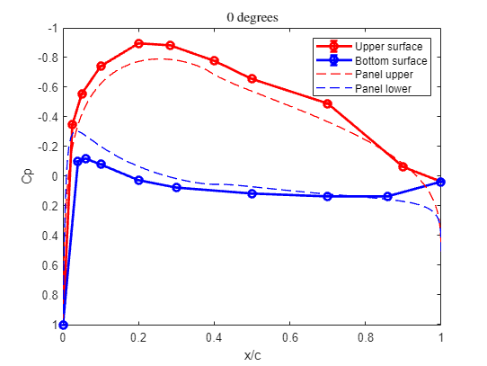


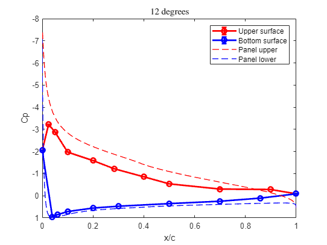


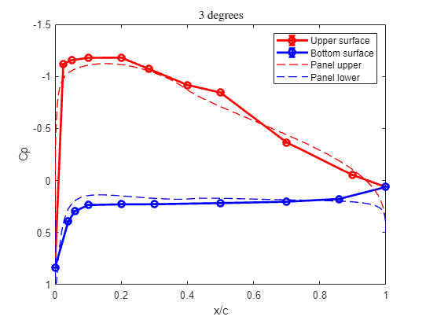


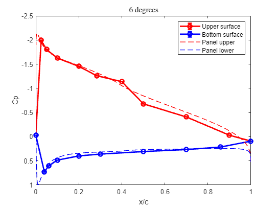


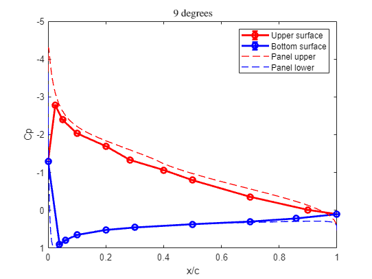


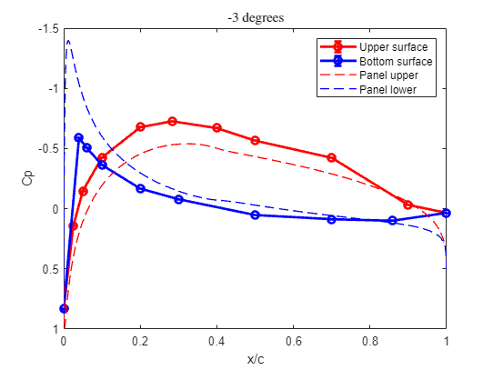


```matlab:Code

%plot cl vs alpha
plst.Cl_struct = structfun(@(x) x.Cl, plst, 'UniformOutput', false);
plst.Cl = cell2mat(struct2cell(plst.Cl_struct));

%Hard code the alphas in the same order for ease
alpha = [0,12,3,6,9,-3];
cl_theory = [.498,1.85,.857,1.20,1.538,.134];
figure;
scatter(alpha,plst.Cl);

%solve for the equation of you line to get Co
ao = (plst.Cl(3)-plst.Cl(1))/(alpha(3)-alpha(1));
syms Co
eqn = plst.Cl(5) == ao*alpha(5)+Co;
Co = solve(eqn,Co);%disp(double(Co));
fprintf('the C_lo is %.02f',Co)
```


```text:Output
the C_lo is 0.48
```


```matlab:Code

%use the previous equation to get alpha zero lift
syms aol
eqn = 0 == ao*aol + Co;
aol = solve(eqn,aol); %disp(double(aol));
fprintf('the alpha zero lift is %.02f',aol)
```


```text:Output
the alpha zero lift is -5.35
```


```matlab:Code
fprintf('the alpha zero lift is -4.1 degrees from panelCode')
```


```text:Output
the alpha zero lift is -4.1 degrees from panelCode
```


```matlab:Code

%plot the theoretical using the equation we jsut solved for
hold on
plot(alpha,2*pi*(alpha-aol)*(pi/180),'g');
scatter(alpha,cl_theory,'r');
hold off

title('C_l vs \alpha');xlabel('\alpha (degrees)'),ylabel('C_l');
legend("experimental", "theoretical","panel","Location","northwest");
```


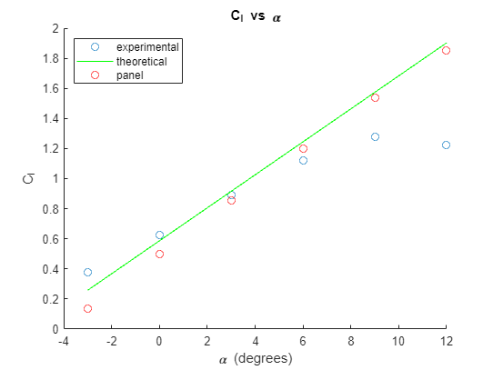


```matlab:Code

%collect and show Ml
disp("the Moments about leading edge are:")
```


```text:Output
the Moments about leading edge are:
```


```matlab:Code
plst.Ml_struct = structfun(@(x) x.Ml, M, 'UniformOutput', false); disp(plst.Ml_struct)
```


```text:Output
       AOA_0deg: -0.2376
      AOA_12deg: -0.3328
       AOA_3deg: -0.2889
       AOA_6deg: -0.3353
       AOA_9deg: -0.3602
    AOA_neg3deg: -0.1753
```


```matlab:Code
disp("the Coeff Moments about leading edge are:")
```


```text:Output
the Coeff Moments about leading edge are:
```


```matlab:Code
disp(cell2mat(struct2cell(plst.Ml_struct))/(.5*air_density*c^2*20^2));
```


```text:Output
   1.0e-07 *

   -0.1719
   -0.2408
   -0.2090
   -0.2426
   -0.2606
   -0.1268
```


```matlab:Code
%M.Ml = cell2mat(struct2cell(M.Ml_struct)); disp(M.Ml);

%plot leading edge
figure
scatter([0,12,3,6,9,-3],cell2mat(struct2cell(plst.Ml_struct))/(.5*air_density*c^2*20^2))
title('Cm_{LE}  vs \alpha')
ylabel('Cm_{LE}'); xlabel('\alpha (degrees)');
```


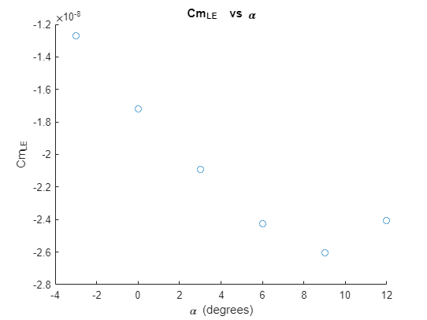


```matlab:Code

%collect and show Mc4
disp("the Moments about quarter cord are:")
```


```text:Output
the Moments about quarter cord are:
```


```matlab:Code
plst.Mc4_struct = structfun(@(x) x.Mc4, M, 'UniformOutput', false); disp(plst.Mc4_struct);
```


```text:Output
       AOA_0deg: 10.1000
      AOA_12deg: 10.1406
       AOA_3deg: 10.1218
       AOA_6deg: 10.1417
       AOA_9deg: 10.1524
    AOA_neg3deg: 10.0736
```


```matlab:Code
disp("the Coeff Moments about the quarter chord are:")
```


```text:Output
the Coeff Moments about the quarter chord are:
```


```matlab:Code
disp(cell2mat(struct2cell(plst.Mc4_struct))/(.5*air_density*c^2*20^2));
```


```text:Output
   1.0e-06 *

    0.7307
    0.7337
    0.7323
    0.7338
    0.7345
    0.7288
```


```matlab:Code

%plot quarter cord
figure
scatter([0,12,3,6,9,-3],cell2mat(struct2cell(plst.Mc4_struct))/(.5*air_density*c^2*20^2))
title('Cm_{c/4}  vs \alpha')
ylabel('Cm_{c/4}'); xlabel('\alpha (degrees)');
```


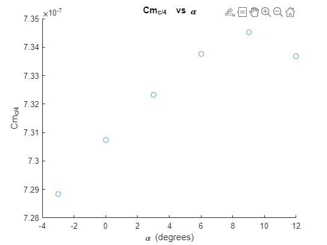


```matlab:Code

%M.Mc4 = cell2mat(struct2cell(M.Mc4_struct)); disp(M.Mc4);
%calculate teh uw:
fields = fieldnames(wake_struct);
for i = 1:numel(fields)
    field_name = fields{i};

    %extract all needed values
    calc.(field_name).pAtm = structfun(@(x) x.pAtm, wake_struct.(field_name), 'UniformOutput', false);
    calc.(field_name).tAtm = structfun(@(x) x.tAtm, wake_struct.(field_name), 'UniformOutput', false);
    calc.(field_name).ro = structfun(@(x) ((x.pAtm/(R*x.tAtm))), wake_struct.(field_name), 'UniformOutput', false);
    calc.(field_name).dp = structfun(@(x) mean(x.dp*248.84), wake_struct.(field_name), 'UniformOutput', false);
    calc.(field_name).uw = structfun(@(x) mean((2*x.dp*248.84/((x.pAtm/(R*x.tAtm)))).^.5), wake_struct.(field_name), 'UniformOutput', false); %from inch wtcol to pa
    calc.(field_name).zCurr = structfun(@(x) x.zCurr*0.0254, wake_struct.(field_name), 'UniformOutput', false); %convert it from inches to meters

end

%plot uw vs z
plst.ZCurr = structfun(@(x) x.zCurr, calc, 'UniformOutput', false);

plst.uw = structfun(@(x) x.uw, calc, 'UniformOutput', false);

%plot each graph
fields = fieldnames(plst.uw);
for i = 1:numel(fields)
    field_name = fields{i};
    plst.uw_tmp_matrix= cell2mat(struct2cell(plst.uw.(field_name)));
    plst.Zcurr_tmp_matrix= cell2mat(struct2cell(plst.ZCurr.(field_name)));
    
    figure
    scatter(plst.uw_tmp_matrix,plst.Zcurr_tmp_matrix,'r','LineWidth',2);

    %graphical stuff
    ylabel('y(m)'); xlabel('u_w (ms^{-1})');
    degree_str = str2double(field_name(4));
    if isnan(degree_str)
        degree_str = -3;
    end 
    title(sprintf('%d degrees', degree_str), 'Interpreter', 'latex');

    %this removes data points that are within one velocity standard
    %deviation that way I can calculate the free stream without hardcoding
    %it
    fprintf('Number of matrices: %d\n', numel(plst.uw_tmp_matrix));
    indices_within_std = abs(plst.uw_tmp_matrix - mean(plst.uw_tmp_matrix(:))) <= .9*std(plst.uw_tmp_matrix(:));
    fprintf('Number of matrices after finding indices within one standard deviation: %d\n', numel(find(indices_within_std)));
    plst.(field_name).U_inf = mean(plst.uw_tmp_matrix(indices_within_std));
    
    
    % calcualte drage and drag coeff
    calc.(field_name).D = air_density*trapz(plst.Zcurr_tmp_matrix(indices_within_std),plst.uw_tmp_matrix(indices_within_std).*(plst.(field_name).U_inf-plst.uw_tmp_matrix(indices_within_std)));
    calc.(field_name).Cd = calc.(field_name).D/(0.5*air_density*plst.(field_name).U_inf^2*c);
end
```


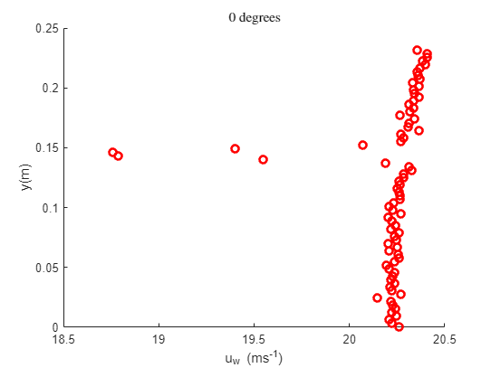


```text:Output
Number of matrices: 77
Number of matrices after finding indices within one standard deviation: 73
```


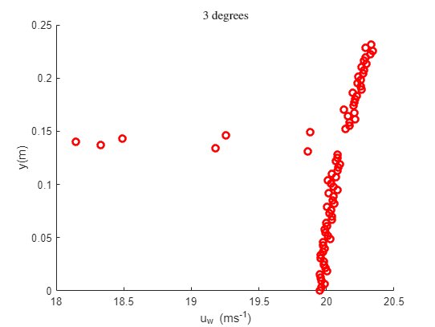


```text:Output
Number of matrices: 77
Number of matrices after finding indices within one standard deviation: 72
```


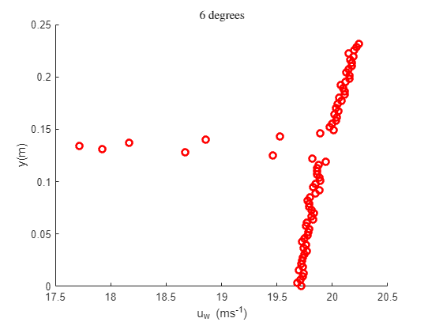


```text:Output
Number of matrices: 77
Number of matrices after finding indices within one standard deviation: 70
```


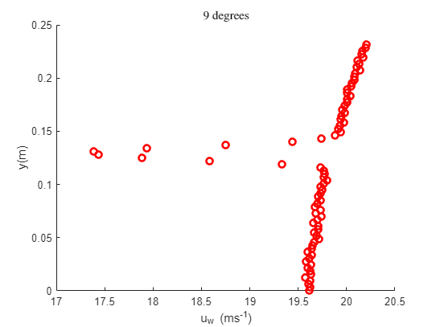


```text:Output
Number of matrices: 77
Number of matrices after finding indices within one standard deviation: 69
```


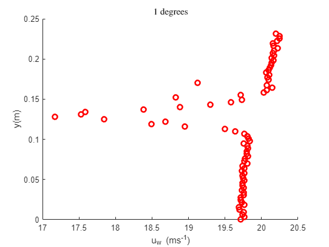


```text:Output
Number of matrices: 77
Number of matrices after finding indices within one standard deviation: 65
```


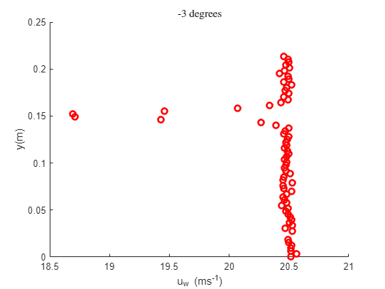


```text:Output
Number of matrices: 69
Number of matrices after finding indices within one standard deviation: 64
```


```matlab:Code

%Show the drag 
disp('The drag forces are newtons:')
```


```text:Output
The drag forces are newtons:
```


```matlab:Code
plst.D_struct = (structfun(@(x) x.D, calc, 'UniformOutput', false)); disp(plst.D_struct)
```


```text:Output
       AOA0: 0.1814
       AOA3: 0.4283
       AOA6: 0.1632
       AOA9: 1.0753
      AOA12: 0.6389
    AOAneg3: -0.2405
```


```matlab:Code

%plot the drag
disp('The C_ds are:')
```


```text:Output
The C_ds are:
```


```matlab:Code
plst.Cd_struct = structfun(@(x) x.Cd, calc, 'UniformOutput', false); disp(plst.Cd_struct)
```


```text:Output
       AOA0: 3.0662e-06
       AOA3: 7.3669e-06
       AOA6: 2.8623e-06
       AOA9: 1.9035e-05
      AOA12: 1.1252e-05
    AOAneg3: -3.9845e-06
```


```matlab:Code
plst.Cd = cell2mat(struct2cell(plst.Cd_struct));
%i am hard coding the order of struct alphas because i am lazy
alpha = [0,3,6,9,12,-3];
figure;
scatter(alpha,plst.Cd)
hold on;

%plot theoretical Cd vs alpha, please note grieshma said this should just
%be zero since it is thin airfoil theory, we used standard roughness
plot(linspace(-5,15),zeros(100),'LineWidth',3)
title('C_d vs \alpha');xlabel('\alpha (degrees)'),ylabel('C_d');
legend('experimental','theoretical','location','northwest');

%plot the experimental Cd vs Cl alpha
Cd_alpha = [0,3,6,9,12,-3];
Cl_alpha = [0,12,3,6,9,-3];

sorted_cd = [plst.Cd(6),plst.Cd(1),plst.Cd(2),plst.Cd(3),plst.Cd(4),plst.Cd(5)];
sorted_cl = [plst.Cl(6),plst.Cl(1),plst.Cl(3),plst.Cl(4),plst.Cl(5),plst.Cl(2)];
hold off;
```


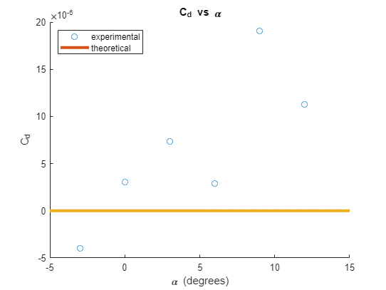


```matlab:Code
scatter(sorted_cl,sorted_cd)

%plot theoretical Cd vs Cl
webplot_dataset_1 = readmatrix('Default Dataset 1.csv');
webplot_Cd = webplot_dataset_1(:,1);  % Cd values
webplot_Cl = webplot_dataset_1(:,2);  % Cl values

hold on; grid on;
scatter(webplot_Cd, webplot_Cl)
xlabel('C_l'); ylabel('C_d'); title('C_l vs C_d'); legend('experimental','theoretical','location','northwest')
```


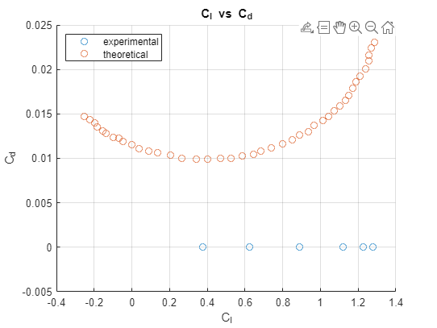


```matlab:Code

```


```matlab:Code
function data_struct = read_csv_files(folder_path)
    % List all .csv files in the folder
    files = dir(fullfile(folder_path, '*.csv'))

    % Initialize the struct to store data
    data_struct = struct();

    % Loop through each file
    for i = 1:numel(files)
        file_path = fullfile(folder_path, files(i).name);
        % Read the data from the CSV file
        data_table = readtable(file_path);
            
        % Get the variable name from the file name (remove .csv extension)
        [~, var_name, ~] = fileparts(files(i).name);
        % Assign the data to a field in the struct with the file name
        data_struct.(var_name) = data_table;
    end
end

function data_struct = read_mat_files(folder_path)
    % List all .csv files in the folder
    files = dir(fullfile(folder_path, '*.mat'));

    % Initialize the struct to store data
    data_struct = struct();

    % Loop through each file
    for i = 1:numel(files)
        file_path = fullfile(folder_path, files(i).name);
        % Read the data from the CSV file
        data_table = load(file_path);
            
        % Get the variable name from the file name (remove .csv extension)
        [~, var_name, ~] = fileparts(files(i).name);
        % Assign the data to a field in the struct with the file name
        data_struct.(var_name) = data_table;
    end
end
```

